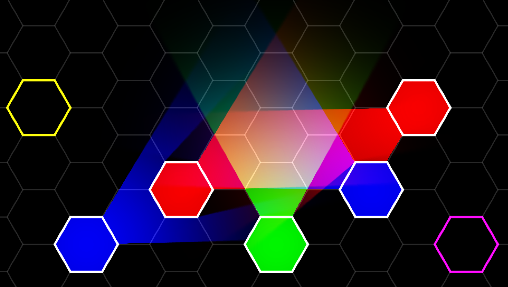

# SIMPLE LOVE LIGHTS
This is a very simple implementation of [mattdesl's *Pixel Perfect 2D Shadows*](https://github.com/mattdesl/lwjgl-basics/wiki/2D-Pixel-Perfect-Shadows) in Love2d/Lua. The code is simple and easy to understand. It is useful for applications that need bare-bone 2D raycasted lights and shadows. (No advanced features, such as normal maps, are provided.)

This was built and tested with Love 0.10.2. 

# API

```
addLight(x, y, size, r, g, b)
clearLights()
```

From your `love.draw()` function, you **must** call the provided function `drawLights(drawOccludersFn, coordTransX, coordTransY)`. `drawOccludersFn` is a callback that draws all shadow-casting objects in the scene. (I recommend you store this in a variable, and then call it a second time from `love.draw()` to actually draw the objects.)

# Examples
